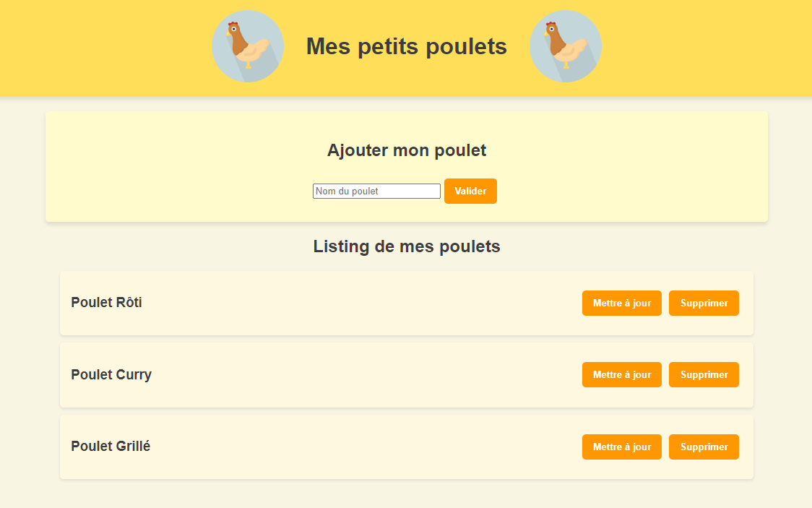

# Exercice CRUD CHICKEN

Exercice : Créez une interface utilisateur en React avec pour thème le poulet, respectant les principes CRUD (Create, Read, Update, Delete). Concentrez-vous uniquement sur le visuel , sans fonctionnalité. Soyez créatifs et amusez-vous !

# Crudchicken
